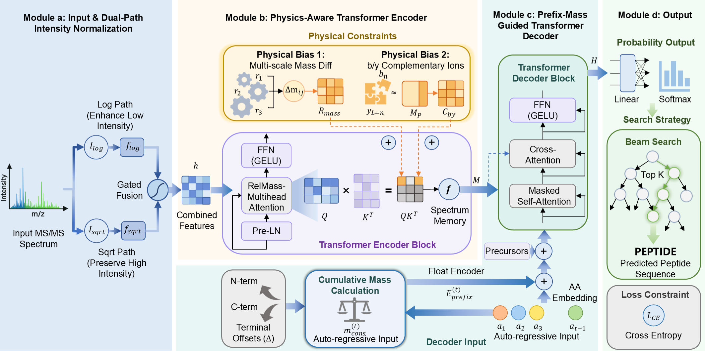

# PhysNovo

This repository contains inference code for **PhysNovo**.

## Architecture

The overall architecture of PhysNovo.



## Requirements

- create the conda environment

```
conda env create -f environment.yml
conda activate physnovo
```

## Pretrained Models

- Nine-Species Model：https://doi.org/10.5281/zenodo.20687570
- Non-Enzymatic Model：https://doi.org/10.5281/zenodo.20687690

## Validation

```
python main.py --mode=eval --gpu=0 --config=./config.yaml --output=evaluate.log --peak_path=./*.mgf --model=the_path_of_your_model
```


